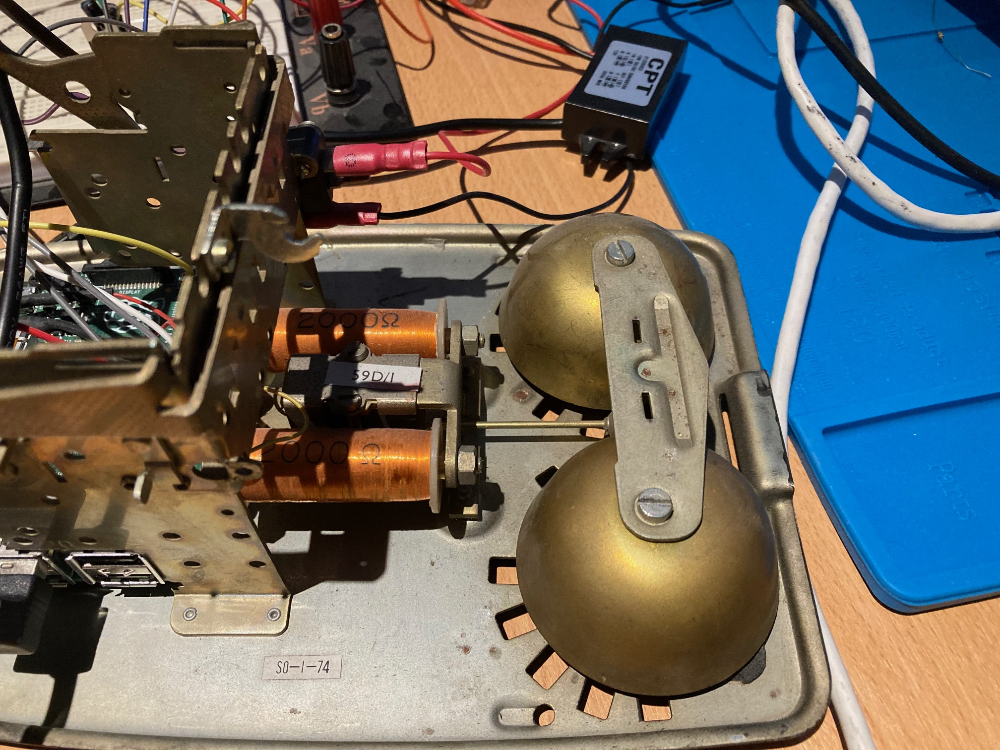
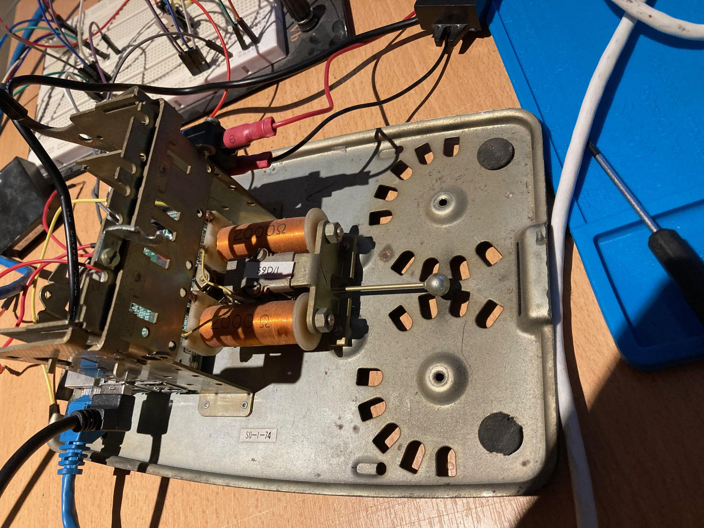
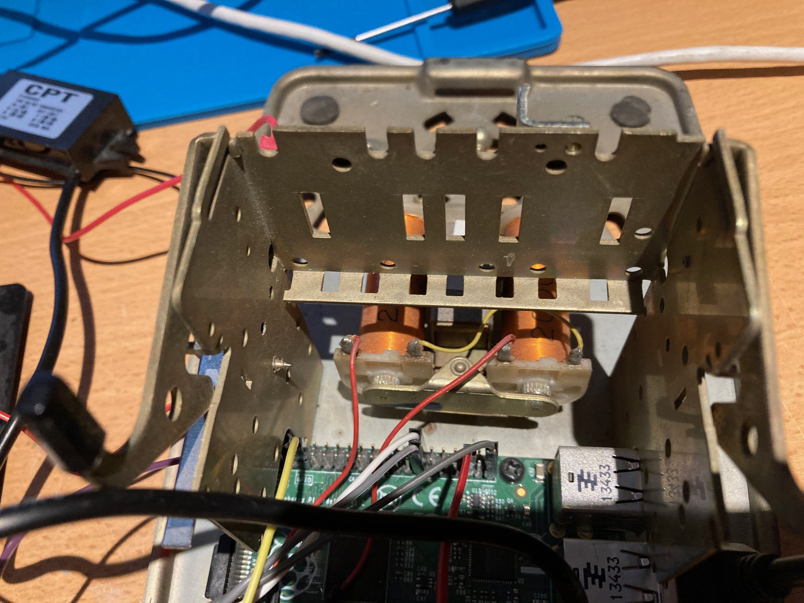
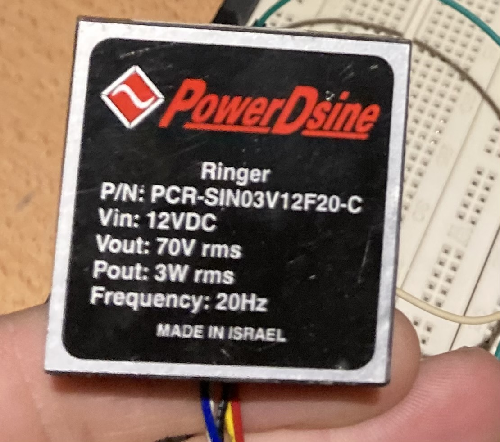
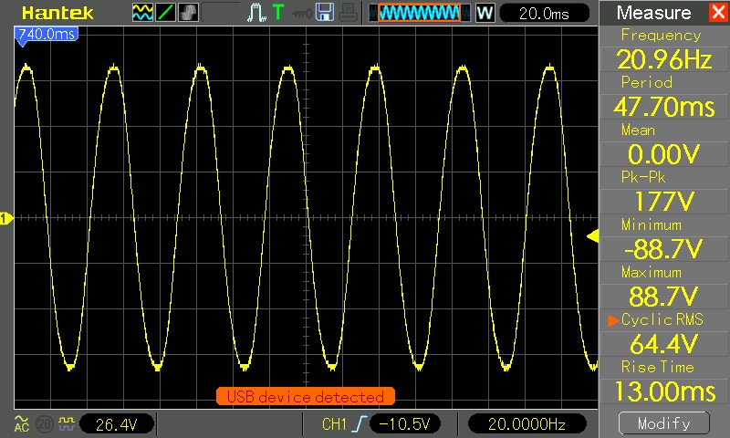

Ringer
======

The Bakelite phone contains a pretty distinctive sounding ringer. It was important for this project
to preserve that sound. The ringer comprises of two solenoid coils, connected to a hammer. The AC
current causes the hammer to move back and forth between the coils, banging on the bells.

*Ringer Bells*

*Solenoid and Hammer with Bells Removed*

*Solenoid*

## Making it Ring

British PSTN ringing voltage is circa 75V AC at 25Hz. I decided to use the `PCR-SIN03V12F20-C` ring generator. 
This is a pre-packaged generator that converts 12V DC to 70V AC at 20Hz. Not exactly right, but who's going 
to notice?

*PCR-SIN03V12F20-C Ring Generator*

The `PCR-SIN03V12F20-C` has 6 pins (only 5 are connected):

* Pin 1: Connection to Solenoid
* Pin 2: Connection to Solenoid
* Pin 3: 12V DC
* Pin 4: GND
* Pin 5: 
* Pin 6: Inhibit

All pins should be pretty self explanatory, except Inhibit. When 5V (relative to GND) is applied to this pin 
it puts the device into low power mode and stops it outputting current to the solenoid.

When connected up to a scope, this is what the wave looks like:

You can see that the wave is around 63V RMS at 20Hz. When connected to the solenoid, it makes a fantastic 
original sound.
